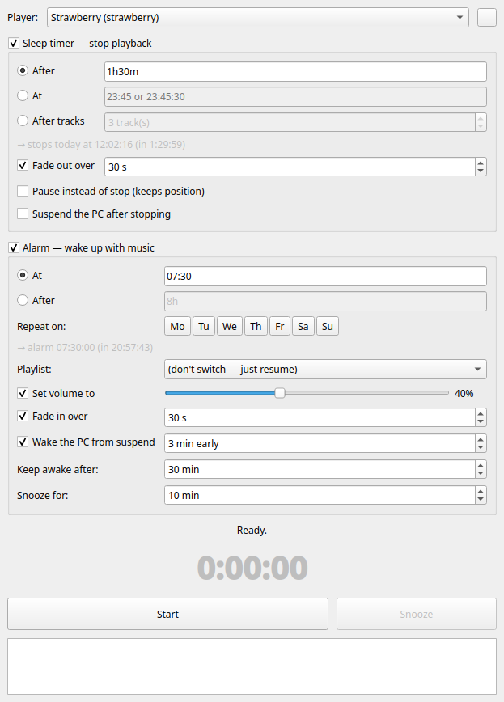

# Strawalarm

**Sleep timer and music alarm for Linux — the AIMP "stop after / wake up
with playlist" feature, for any MPRIS2 player.**



If you searched for "AIMP alarm on Linux": this is that. Fall asleep to
your music (playback stops after a timer or a number of tracks, with a
gentle fade-out), and wake up to a *different* playlist at a set time,
fading in from silence — all in your own music player.

Built for [Strawberry](https://www.strawberrymusicplayer.org/), works
with anything that speaks MPRIS2 (VLC, Elisa, Audacious, ...). Playlist
switching uses the optional MPRIS `Playlists` interface — the alarm
picks from the playlists **already open in your player**; on players
without it, the alarm simply resumes playback.

## Features

- **Sleep timer**: stop or pause after a duration (`1h30m`) or after N
  tracks (the fade-out is timed to end exactly with the last track)
- **Alarm**: at a given time (or after a duration), switch to one of
  the player's open playlists, set the volume, and play — relaunching
  the player first if you closed it
- **Snooze**: a button (and tray action) in the GUI; in the CLI just
  press Enter on a ringing alarm (or send `SIGUSR1`). Pauses the music
  and re-fires after a configurable interval (default 10 min)
- **Recurring alarms**: pick weekdays (GUI buttons or
  `--days mon,wed,fri` / `weekdays` / `weekend` / `daily`) and an
  alarm-only session re-arms itself after each firing
- **Fades**: smooth volume fade-out into sleep, fade-in from silence on
  wake; your original volume is restored after the sleep fade
- **GUI and CLI**: a small Qt app that follows your desktop theme
  (looks native on KDE Plasma), plus a scriptable command line
- **System tray**: closing the window while a timer is armed hides the
  app to the tray, where it keeps counting down (tooltip shows the
  remaining time; right-click to cancel or quit)
- **Suspend-aware**: blocks system sleep while your music plays
  (logind inhibitor), releases the block when it stops — optionally
  suspending the PC right away — and programs an RTC wake a few
  minutes before the alarm so a suspended machine wakes up for it
  (via KDE PowerDevil's scheduleWakeup, no root needed; `rtcwake`
  fallback elsewhere). After the alarm it keeps the system awake for
  a configurable window (default 30 min) so it doesn't doze off
  mid-morning-playlist.
- No daemon, no config files, no Python dependencies beyond Qt for the
  GUI. Talks to the player through `playerctl` and `busctl`.

## Requirements

- Linux with systemd (`busctl`) and [playerctl](https://github.com/altdesktop/playerctl)
- Python ≥ 3.10; PySide6 for the GUI
- An MPRIS2-capable player

Fedora: `sudo dnf install playerctl python3-pyside6`
Debian/Ubuntu: `sudo apt install playerctl python3-pyside6`

## Install

From a checkout — puts `strawalarm`/`strawalarm-gui` in `~/.local/bin`
and adds a launcher ("Strawalarm") to your application menu:

```sh
./install.sh
```

Or with pipx: `pipx install "strawalarm[gui] @ git+https://github.com/Tengro/strawalarm"`
(then copy `data/strawalarm.desktop` and the icon yourself if you want
the menu entry).

## Usage

GUI: launch **Strawalarm** from your app menu, or `strawalarm gui`.

CLI:

```sh
strawalarm list                    # running players + their open playlists

# Sleep timer
strawalarm sleep 1h30m --fade 30           # stop in 1h30m, fade the last 30s
strawalarm sleep --tracks 5 --fade 20      # 5 tracks, fade ending with track 5
strawalarm sleep 1h --pause                # pause instead of stop

# Alarm
strawalarm wake 07:30 --playlist Morning --volume 40 --fade-in 60
strawalarm wake +8h --playlist Morning     # relative time
strawalarm wake 07:30 --playlist Morning --days weekdays  # recurring
# while it rings: press Enter to snooze (--snooze MIN, default 10)

# The full night in one command: fade out in 45 min, suspend the PC,
# wake it at 07:27, fade the Morning playlist in at 07:30
strawalarm sleep 45m --fade 30 --suspend --wake 07:30 --playlist Morning \
          --volume 40 --fade-in 60
```

Durations: `1h30m`, `90m`, `45s`, `01:30:00`, or bare minutes. Playlist
names match case-insensitively (exact, then unique substring). With
several players running, pick one with `--player NAME`.

The CLI runs in the foreground (Ctrl+C cancels). To detach:
`systemd-run --user strawalarm wake 07:30 --playlist Morning`.

## Notes / known limits

- Wake-from-suspend needs KDE PowerDevil (any Plasma desktop) or a
  root-capable `rtcwake`; without either, the alarm still works but
  can't wake a suspended machine. Hibernation is untested.
- **PowerDevil needs `CAP_WAKE_ALARM`** to arm the RTC, and some
  distros (Fedora 44, at least) ship the binary without it — the
  scheduleWakeup API then silently does nothing. Worse, a manual
  `setcap` fix is wiped by every PowerDevil package update. strawalarm
  detects the missing capability and warns when you arm the alarm.
  Permanent fix (installs systemd units that re-apply the capability
  at boot and immediately after updates):

  ```sh
  sudo contrib/install-powerdevil-caps.sh
  # then, as your normal user — NOT inside the sudo/root shell:
  systemctl --user restart plasma-powerdevil.service
  ```

  (Running the restart in a root shell starts a sessionless PowerDevil
  under root's user manager, which crash-loops with a scary but
  harmless "dumped core" message — your desktop's instance is
  unaffected.)
- While the sleep timer plays, only *suspend* is blocked — the screen
  still dims and switches off on your normal schedule. Your desktop's
  battery/energy widget will truthfully show "Strawalarm is preventing
  sleep".
- If the alarm fires the moment the machine resumes (e.g. the RTC wake
  was late or missing), strawalarm waits ~12 s for the audio stack to
  settle and then watches playback for the first minute, restarting the
  player if it choked on a half-initialized audio device.
- All timers use absolute wall-clock deadlines, so suspend/resume
  needs no special handling — the countdown is simply correct when
  the machine wakes up.
- Volume control is the player's own volume, not the system mixer.
- Without `--fade`, `--tracks N` stops the instant track N+1 starts, so
  you may hear a sub-second blip; with a fade it ends cleanly.

## License

MIT
